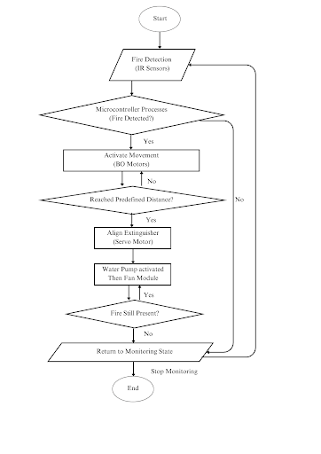
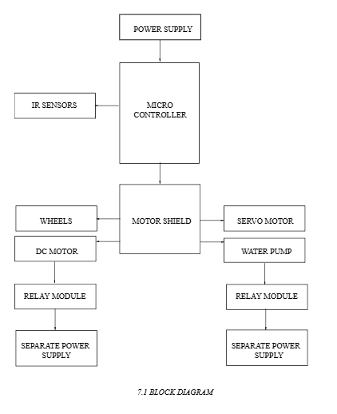
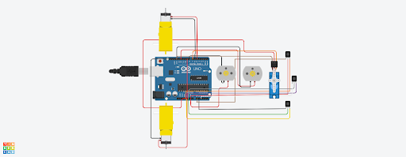
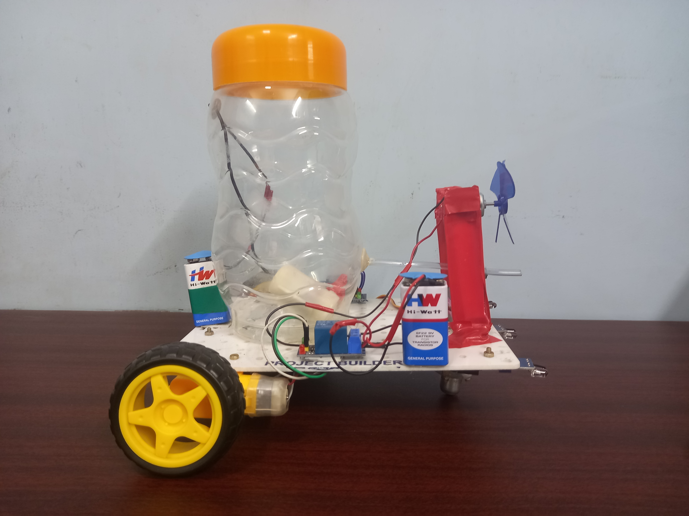

#  Fire Combat Robot

## Final Year Project

## Project Description
The **Fire Combat Robot** is an autonomous robotic system designed to detect, approach, and suppress fire using multiple fire detection and extinguishing mechanisms. The robot uses **multiple IR sensors** to accurately detect fire direction and intensity, allowing intelligent movement and precise fire suppression.

The system is controlled by an **Arduino UNO**, which integrates sensor data, motor control, servo positioning, water pump activation, and fan-based cooling. Upon detecting fire, the robot moves toward the source, activates a **servo-controlled water spray system**, and finally turns on a **fan module** to reduce residual heat and prevent reignition.

This project demonstrates the practical application of **embedded systems, robotics, real-time decision making, and automation**, making it suitable for real-world fire safety applications.

---

## Aim
To design and develop a fire combat robot capable of autonomously detecting fire, navigating toward it, extinguishing it using a water spray mechanism, and preventing reignition through a cooling fan system.

---

## Hardware Specifications
- **Microcontroller:** Arduino UNO  
- **Infrared (IR) Sensors:** 3  
- **Motor Shield**  
- **BO Motors (Wheel Motors)**  
- **Servo Motor**  
- **DC Water Pump (5V)**  
- **Fan Module (DC Motor)**  
- **Relay Modules:** 2  
- **Jumper Wires**  
- **9V Battery**

---

## Module Description

### 5.1 Fire Detection Module
- Uses multiple IR sensors to detect infrared radiation emitted by fire.
- Continuously monitors the environment to reduce false fire detection.
- Sends real-time signals to the Arduino UNO for immediate response.
- Enables dynamic fire tracking for accurate robot navigation.

### 5.2 Motor Control Module
- Controls robot movement toward the fire source.
- Uses Arduino UNO with a motor shield to manage speed and direction.
- Ensures smooth manoeuvrability and controlled motion.
- Optimizes power consumption and prevents motor overheating.

### 5.3 Servo Control Module
- Controls the direction of the water nozzle.
- Adjusts nozzle angle dynamically based on fire location.
- Continuously tracks fire movement for precise targeting.
- Works in synchronization with the water spray module.

### 5.4 Water Spray Module
- Uses a DC water pump to deliver pressurized water.
- Activated only when fire is detected using relay control.
- Minimizes water wastage and improves efficiency.
- Works together with servo motor for accurate fire suppression.

### 5.5 Fan Module
- Activates after fire suppression for cooling.
- Reduces residual heat and prevents reignition.
- Improves smoke dissipation and visibility.
- Operates only when required to conserve power.

---

## Working Principle
1. IR sensors continuously scan the environment.
2. Fire direction is identified based on sensor input.
3. Robot moves toward the fire source.
4. Water pump and servo system activate to extinguish fire.
5. Fan module runs for cooldown after suppression.
6. Robot returns to idle state when no fire is detected.

---

## Project Diagrams and Images

### Data Flow Diagram

### Block Diagram

### Circuit Diagram

### Robot Prototype

---

## Skills & Concepts Applied
- Embedded C Programming (Arduino)
- Sensor Interfacing
- Motor Driver and Shield Control
- Servo Motor Control
- Relay Module Operation
- Real-time Decision Making
- Robotics and Automation

---

## Future Enhancements
- IoT-based fire alert system
- Obstacle avoidance using ultrasonic sensors
- Camera-based fire detection
- Autonomous path planning

---

## Author
**Damini M.K**  
Final Year Project – Fire Combat Robot
